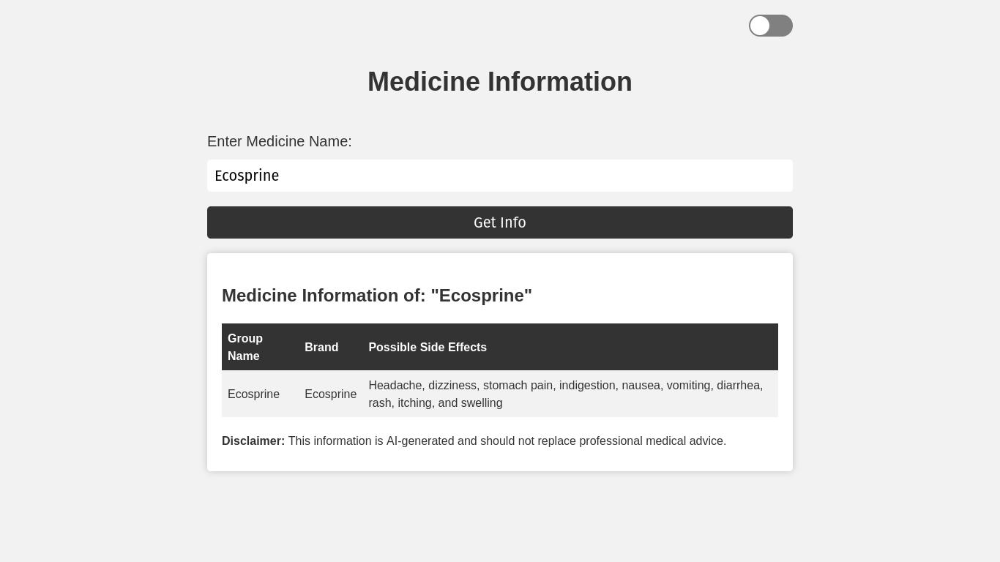
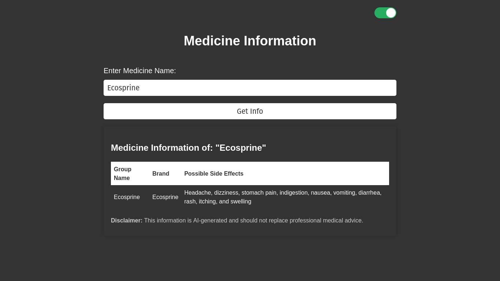

# Medicine Information

An AI based medicine information checker web app that takes your medicine name and checks for its information such as its group name, brand name, side effects, etc. As it is an AI based web app, so we are not sure you will get accurate information about your medicine. So, we recommend you to consult with your doctor before taking any medicine.

Author: [Md. Almas Ali][almas_github]

[](https://github.com/Almas-Ali/medicine-info-ai)
[](LICENSE)

## Screensorts

|                Light Mode                 |                Dark Mode                |
| :---------------------------------------: | :-------------------------------------: |
|  |  |

## How to run this web app

```bash
# Install all the requirements from requirements.txt file
pip install -r requirements.txt

# Create a .env file from .example.env
cp .example.env .env # For Linux
copy .example.env .env # For Windows

# Update the .env file with your OpenAI API key
OPENAI_API=OPENAI_API_KEY

# Run the web app
python app.py

# Open the web app in your browser
http://127.0.0.1:5000/
```

## How to use this web app

The UI is self explanatory. But still, here are the steps to use this web app.

1. Enter your medicine name in the input field.
2. Click on the Get info button.
3. Wait for the AI to generate the information about your medicine.
4. Read the information and consult with your doctor before taking any medicine.

## License

This project is licensed under the MIT License - see the [LICENSE](LICENSE) file for details.

[almas_github]: https://github.com/Almas-Ali "Md. Almas Ali"
